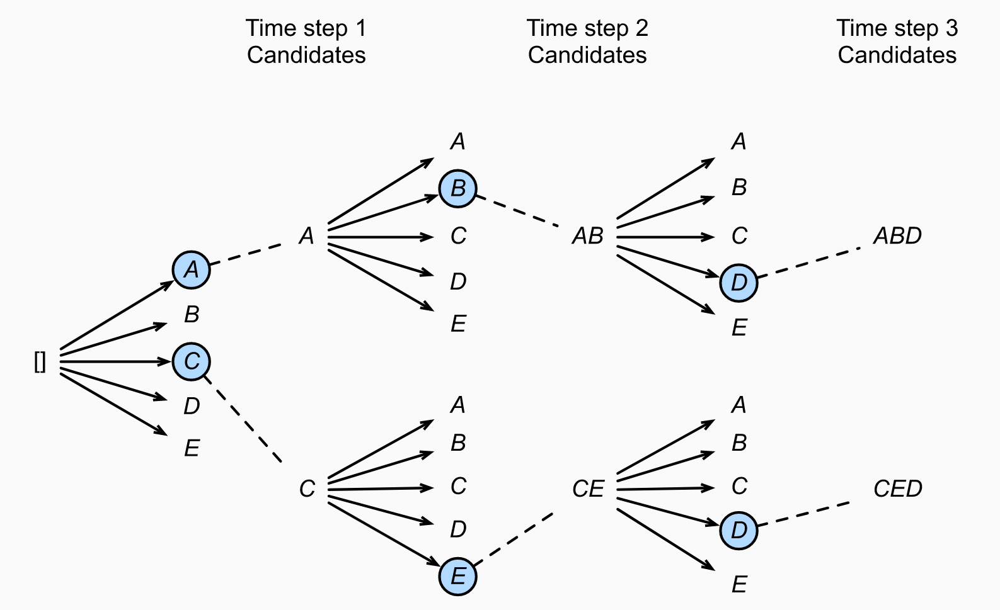
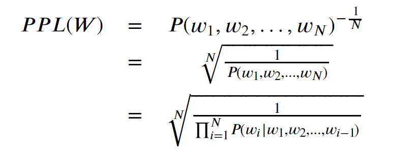
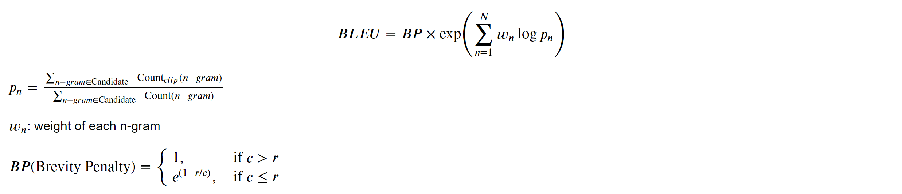
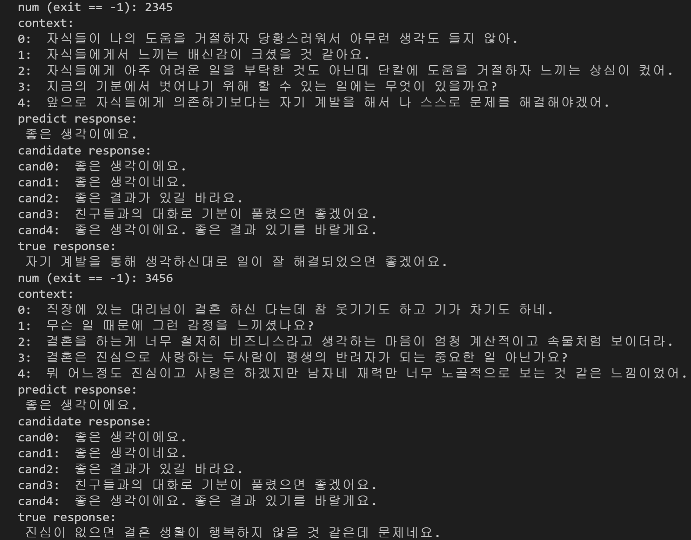
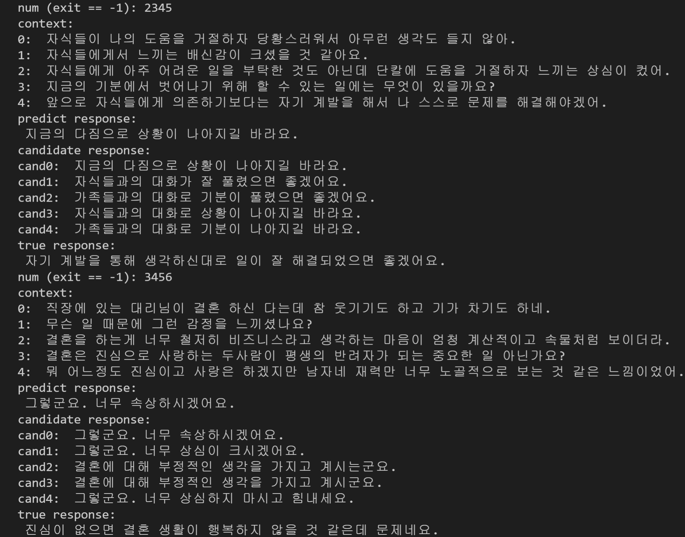

# DialogBERT
Implemented by `TensorFlow`

## Configuration

### Tool

`TensorFlow` for modeling  
`Hydra` for configurating  
`Weights & Bias` for monitoring

### Dataset
- [x] `감성 대화`: emotion coversation dataset, the number of total sentences is 27M.
- [ ] `한국어 SNS`: daily conversation SNS dataset, the number of total turns is 1,600M. 

In DialogBERT, The number of total turns of *Weibo* is 2,052M, *MultiWOZ* is 11M and *DailyDialog* is 10M. 

(sourced by [AIHub](https://aihub.or.kr/aidata/30718)) 

### Tokenizer
`Subword`: We learn and apply *BPE* using the *SentencePiece* library. It prepends `'_'(U+2581)` to every word to mark the original whitespace, then tokenizes text into subword pieces.

`Morpeheme-aware Subword`: We apply *Mecab-Ko* and *BPE* in sequence to make morpheme-aware subwords. *BPE* is applied after the original text is split into morphemes. 

(referenced by [An Empirical Study of Tokenization Strategies for Various Korean NLP Tasks](https://arxiv.org/abs/2010.02534))

### Model
`DialogBERT`: Hierarchical Transformer encoder architecture + Novel training objective(*masked utterance regression* and *distributed uttreance re-ordering*).

`DialogBERT` is 40.2M ⟷ `DialogGPT` is 12.7M.

(paper path [DialogBERT: Discourse-Aware Response Generation via Learning to Recover and Rank Utterances](https://arxiv.org/abs/2012.01775))

### Hyper parameter
We reduces the `bert-base-uncased` configuration to L=6, H=256, A=2.

We limit *the number of utterances in each context* to 7 *words* and *the utterance length* to 30 *words*.  

We use `Adam` optimizer (not `AdamW`) with learning rate as 1e^-5 (not 5e^-5).

For more, we reduces context encoder configuration to L=3.

(referenced by [DialogBERT: Discourse-Aware Response Generation via Learning to Recover and Rank Utterances](https://arxiv.org/abs/2012.01775))

### Decoding Strategy

- [x] Beam Search: It maintains a fixed-size set of partially-decoded sequences, called hypotheses. At each time step, beam search forms new hypotheses by appending each token in the vocabulary to each existing hypothesis, scoring the resulting sequences then selecting the highest scoring sequences.

(referenced by [Recipes for building an open-domain chatbot](https://arxiv.org/abs/2004.13637))

(referenced by [DIVE INTO DEEP LEARNING](https://d2l.ai/chapter_recurrent-modern/beam-search.html))
### Evaluation
- [x] `PPL(perplexity)`:

- [ ] `BLEU Score(Bilingual Evaluation Understudy Score)`: measures how many *n-grams* in a generated response overlap with those of the reference. 

- [ ] `NIST`: variant of `BLEU` that penalizes uniformative *n-grams* by assigning weights to *n-grams* according to their infromation gain.

- [ ] `SSA(Sensibleness and Specificity Average)`

(referenced by [DialogBERT: Discourse-Aware Response Generation via Learning to Recover and Rank Utterances](https://arxiv.org/abs/2012.01775))

(referenced by [Towards a Human-like Open-Domain Chatbot](https://arxiv.org/abs/2001.09977))

## Experiment

The `DialogAll` model generates **the same response** in every conversation.

However, the `DialogNug` model responses in a variety of ways.

In my opinion, `MUR` and `ORNS` are not suitable objective in dialog generation model.  
If not, my code is wrong.

## Result

[click here](https://wandb.ai/gj98/dialogBERT/reports/DialogBERT--VmlldzoxNTE1Mzc5?accessToken=gnx4usj6u3dcqshxfv1w2s7en6igld0hwk4qqx7aw37oh68nxnmd1e68xq9fc4xa) for `Weights & Bias` reports.

`DialogAll`
- `Accuarcy`: 0.4951
- `PPL(Perplexity)`: 37.256

`DialogNug`
- `Accuarcy`: 0.509
- `PPL(Perplexity)`: 31.963